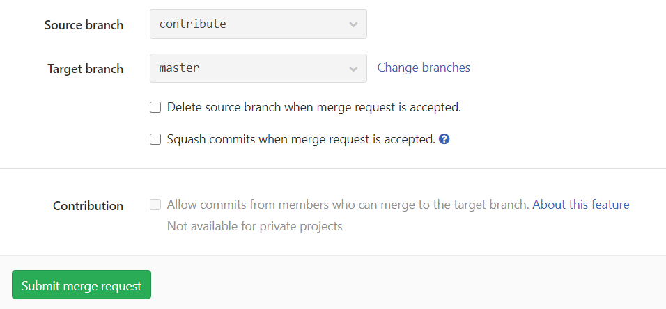

# Contributing

The Cluster Management group on StoGit consists of multiple repositories.
This document is a guide for making changes  and contributing to these repositories.
The workflow is essentially the same as any development workflow followed by organizational GitHub repositories.

## Workflow

Replace `documentation` with your desired repository while running the following commands.

1. Fork the repository you want to work on to your own workspace


2. Clone the forked repository on your machine
```
git clone https://stogit.cs.stolaf.edu/de1/documentation.git
```
or if you have `ssh` set up, you can use that instead:
```
git clone git@stogit.cs.stolaf.edu:de1/documentation.git
```

3. Add the source repository as upstream to pull changes
```
git remote add upstream https://stogit.cs.stolaf.edu/bw/documentation.git
```
or if you have `ssh` set up:
```
git remote add upstream git@stogit.cs.stolaf.edu:de1/documentation.git
```

4. Go into the directory where you cloned the repository and create a new branch
```
git checkout -b <branch>
```
Choose a suitable branch name (preferably one word) that is connected to the changes you are going to make.

4. Make whatever changes or updates are required.
Be sure to pull changes from remote before starting your work each time
```
git pull upstream master
```

5. Commit all your changes and push your branch
```
git add [file1] [file2] ...
git commit -m "<commit message>"
git pull origin master
git push origin <branch>
```

6. Open StoGit, go to your fork and click on **Create Merge Request** for your branch


7. If it is not ready for merging, add the `WIP` (Work In Progress) to the title.
Write a description of what this addition accomplishes.
Scroll down and make sure the correct *Source* and *Target* branches are selected.
Click on **Submit Merge Request**.


8. A Lead Cluster Manager will review the merge request, request further changes as necessary and finally merge it with the `master` branch of the applicable repository.
If the request is submitted by a Lead Cluster Manager, it is recommended that another Lead reviews the request before it is merged.

9. It is also preferable to delete the source branch upon merging to maintain one master branch with all the code up to date.
Since we are not releasing software with different versions, there are no caveats for not having older versions available to us, as of now.

10. To keep your fork up to date with the main repository
```
git checkout master
git pull upstream master
git push origin master
```

## Documentation

Effort should be made to keep the documentation up to date and uniform. The *Training Team* should be primarily in charge of the [`documentation`](https://stogit.cs.stolaf.edu/bw/documentation) repository. That being said, any other Cluster Manager is welcome to contribute as long as they adhere to the guidelines mentioned in this document.

### New Documents

1. Cluster Manager works on something and creates a Google Doc in the process enlisting the steps or useful knowledge learned in the process
2. The *Training Team* creates a markdown document from the Google Doc, adhering to the **Markdown Conventions** as listed below
3. A Merge Request is created by the *Training Team* which is then reviewed and updated and finally merged by a Lead Cluster Manager

### Existing Documents

1. A Cluster Manager notices a change required in an existing document and creates an *Issue* with details about the necessary change.
If it is a big change, the *New Document* procedure should be followed.
2. The *Training Team* reviews the *Issue* and makes necessary changes and creates a Merge Request.
3. A Lead Cluster Manager reviews the changes and merges the request into master.

### Markdown Conventions

* Each sentence should start on a new line
* Keep sentences as short as possible
* There should be a newline at the end of every file
* Headings should not be wordy
* All commands, variable names, file names, file paths, branch names and numbers should generally be in code formats
(i.e. single line code or multi-line code)
* All URLs should be provided in the form of links
* All links should be embedded into words/phrases that describe what the link is
* Any image should be stored in the `images` directory in the repository
* Italicize and Bold words for information that needs to be paid attention to or may require external clarification
